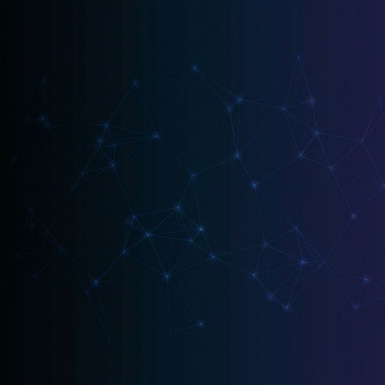

<!-- ═══════════════════════════════════════════════════════════════════════════
     RISHAV ANAND — GitHub Profile README
     A portfolio-website-style professional profile
     ═══════════════════════════════════════════════════════════════════════════ -->

<!-- ▀▀▀▀▀▀▀▀▀▀▀▀▀▀▀▀▀▀▀▀▀▀▀▀▀▀▀ HERO SECTION ▀▀▀▀▀▀▀▀▀▀▀▀▀▀▀▀▀▀▀▀▀▀▀▀▀▀▀ -->

<div align="center">



<br/><br/>


<br/>


<br/><br/>

<!-- Navigation Pills -->
<a href="#-about"></a>&nbsp;
<a href="#-expertise"></a>&nbsp;
<a href="#-experience"></a>&nbsp;
<a href="#-projects"></a>&nbsp;
<a href="#-achievements"></a>&nbsp;
<a href="#-contact"></a>

<br/><br/>

<!-- Social Icons Row -->
<a href="https://linkedin.com/in/YOUR-LINKEDIN"></a>&nbsp;&nbsp;
<a href="https://YOUR-PORTFOLIO-URL"></a>&nbsp;&nbsp;
<a href="https://kaggle.com/YOUR-KAGGLE"></a>&nbsp;&nbsp;
<a href="https://hackerrank.com/YOUR-HACKERRANK"></a>&nbsp;&nbsp;
<a href="mailto:rishav6604@gmail.com"></a>

</div>

<br/>


<br/>

<!-- ▀▀▀▀▀▀▀▀▀▀▀▀▀▀▀▀▀▀▀▀▀▀▀▀▀▀▀ ABOUT SECTION ▀▀▀▀▀▀▀▀▀▀▀▀▀▀▀▀▀▀▀▀▀▀▀▀▀ -->

##  &nbsp;About

<table>
<tr>
<td width="60%">

AI Engineer with production experience in designing, building, and deploying **LLM-powered applications**, **autonomous multi-agent systems**, and **end-to-end machine learning pipelines**.

I specialize in the full AI lifecycle — from **RAG architectures** and **prompt engineering** to **model orchestration**, **cloud deployment**, and **monitoring**. My work focuses on translating complex business requirements into scalable, reliable AI systems that deliver measurable impact.

<br/>

🎓 &nbsp;**B.Sc. Information Technology** — Marwari College, Bhagalpur *(2024 – 2026)*

</td>
<td width="40%" align="center">

```json
{
  "focus": [
    "LLM Applications",
    "Agentic AI Systems",
    "ML Pipelines",
    "Cloud-Native AI"
  ],
  "open_to": [
    "AI/ML Engineering Roles",
    "Open-Source Collaboration",
    "Research Partnerships"
  ]
}
```

</td>
</tr>
</table>

<br/>


<br/>

<!-- ▀▀▀▀▀▀▀▀▀▀▀▀▀▀▀▀▀▀▀▀▀▀▀▀▀ EXPERTISE SECTION ▀▀▀▀▀▀▀▀▀▀▀▀▀▀▀▀▀▀▀▀▀▀▀ -->

##  &nbsp;Expertise

<table>
<tr>
<td align="center" width="50%">

<br/>


<br/><br/>

**Languages & Frameworks**

`Python` · `SQL` · `FastAPI` · `Flask`

<br/>

</td>
<td align="center" width="50%">

<br/>


<br/><br/>

**Cloud & DevOps**

`AWS` · `GCP` · `Azure` · `Docker` · `GitHub Actions`

<br/>

</td>
</tr>
<tr>
<td align="center" width="50%">

<br/>


<br/><br/>

**Generative AI & LLMs**

`OpenAI GPT-4` · `Gemini Pro` · `LangChain` · `LangGraph`
`Hugging Face` · `Ollama` · `RAG` · `Prompt Engineering`

<br/>

</td>
<td align="center" width="50%">

<br/>


<br/><br/>

**ML & Data Engineering**

`Scikit-learn` · `MLflow` · `Pinecone` · `Redis`
`Feature Engineering` · `Model Monitoring`

<br/>

</td>
</tr>
</table>

<br/>


<br/>

<!-- ▀▀▀▀▀▀▀▀▀▀▀▀▀▀▀▀▀▀▀▀▀▀▀▀ EXPERIENCE SECTION ▀▀▀▀▀▀▀▀▀▀▀▀▀▀▀▀▀▀▀▀▀▀▀ -->

##  &nbsp;Experience

<br/>

<table>
<tr>
<td width="100%">

###  &nbsp; Unified Mentor Pvt. Ltd.

<sub>📅 June 2025 – December 2025</sub>

<br/>

&nbsp;&nbsp;&nbsp;&nbsp;▸ &nbsp;Designed and shipped **end-to-end ML & AI pipelines** — data ingestion through model delivery  
&nbsp;&nbsp;&nbsp;&nbsp;▸ &nbsp;Built **predictive and forecasting models** supporting business decisions across multiple domains  
&nbsp;&nbsp;&nbsp;&nbsp;▸ &nbsp;Developed **reusable preprocessing & feature engineering modules** for model stability at scale  
&nbsp;&nbsp;&nbsp;&nbsp;▸ &nbsp;Collaborated **cross-functionally** to translate real-world business problems into AI-driven solutions

</td>
</tr>
</table>

<table>
<tr>
<td width="100%">

###  &nbsp; Infosys Springboard

<sub>📅 August 2025 – October 2025</sub>

<br/>

&nbsp;&nbsp;&nbsp;&nbsp;▸ &nbsp;**Led a 15-member Agile team** in building reliable, deployable AI applications  
&nbsp;&nbsp;&nbsp;&nbsp;▸ &nbsp;Architected **AI-driven workflows** — preprocessing → model orchestration → evaluation → backend  
&nbsp;&nbsp;&nbsp;&nbsp;▸ &nbsp;Deployed **end-to-end AI systems** integrating data pipelines, ML/LLM inference, and application services

</td>
</tr>
</table>

<br/>


<br/>

<!-- ▀▀▀▀▀▀▀▀▀▀▀▀▀▀▀▀▀▀▀▀▀▀▀▀▀ PROJECTS SECTION ▀▀▀▀▀▀▀▀▀▀▀▀▀▀▀▀▀▀▀▀▀▀▀▀ -->

##  &nbsp;Projects

<br/>

<table>
<tr>
<td width="50%" valign="top">

<div align="center">
  
</div>

<br/>

<div align="center">
  
  
  
  
  
</div>

<br/>

#### 🤖 AI Powered Medical Chatbot

Medical Q&A system built on **RAG architecture**. Uses HuggingFace Sentence-Transformers for document embedding and **Pinecone** for vector retrieval. **GPT-4** generates context-aware medical responses. Flask API with real-time inference. Dockerized and deployed on **AWS EC2** with GitHub Actions CI/CD.

<br/>

<div align="center">
  <a href="https://github.com/YOUR-GITHUB-USERNAME/ai-medical-chatbot"></a>
</div>

</td>
<td width="50%" valign="top">

<div align="center">
  
</div>

<br/>

<div align="center">
  
  
  
  
  
</div>

<br/>

#### 🧠 Autonomous Research Agent

Multi-agent system on **LangGraph** with tool-calling — web search, document parsing, API integrations. **Redis** provides stateful memory for multi-step reasoning and contextual task execution. Exposed via **FastAPI**, containerized with Docker, deployed on **AWS** for production-grade autonomous AI.

<br/>

<div align="center">
  <a href="https://github.com/YOUR-GITHUB-USERNAME/autonomous-research-agent"></a>
</div>

</td>
</tr>
</table>

<br/>

<table>
<tr>
<td width="100%">

<div align="center">
  
  
  
  
  
</div>

<br/>

#### 📊 &nbsp;End-to-End ML Pipeline & Model Monitoring System

Full ML lifecycle platform covering the complete journey: **data ingestion → feature engineering → Scikit-learn model training → MLflow experiment tracking & versioning → Dockerized FastAPI inference on Google Cloud Platform**. Includes automated model validation and retraining triggers for continuous production reliability.

<br/>

<div align="center">
  <a href="https://github.com/YOUR-GITHUB-USERNAME/ml-pipeline-monitoring"></a>
</div>

<br/>

</td>
</tr>
</table>

<br/>


<br/>

<!-- ▀▀▀▀▀▀▀▀▀▀▀▀▀▀▀▀▀▀▀▀▀▀▀ GITHUB STATS SECTION ▀▀▀▀▀▀▀▀▀▀▀▀▀▀▀▀▀▀▀▀▀▀ -->

##  &nbsp;GitHub Analytics

<br/>

<div align="center">


</div>

<br/>

<div align="center">
  
</div>

<br/>

<div align="center">
  
</div>

<br/>


<br/>

<!-- ▀▀▀▀▀▀▀▀▀▀▀▀▀▀▀▀▀▀▀▀▀▀ ACHIEVEMENTS SECTION ▀▀▀▀▀▀▀▀▀▀▀▀▀▀▀▀▀▀▀▀▀▀▀ -->

##  &nbsp;Achievements

<br/>

<div align="center">
<table>
<tr>
<td align="center" width="33%">
  <br/>
  
  <br/><br/>
  <strong>Certified AI Engineer &<br/>Generative AI Engineer</strong>
  <br/><br/>
</td>
<td align="center" width="33%">
  <br/>
  
  <br/><br/>
  <strong>Forward Program<br/>Certified Badge</strong>
  <br/><br/>
</td>
<td align="center" width="33%">
  <br/>
  
  <br/><br/>
  <strong>Open Source Contributor<br/>Summer of Code</strong>
  <br/><br/>
</td>
</tr>
</table>
</div>

<br/>


<br/>

<!-- ▀▀▀▀▀▀▀▀▀▀▀▀▀▀▀▀▀▀▀▀▀▀▀▀ CONTACT SECTION ▀▀▀▀▀▀▀▀▀▀▀▀▀▀▀▀▀▀▀▀▀▀▀▀▀▀ -->

##  &nbsp;Contact

<br/>

<div align="center">

*I'm always interested in collaborating on AI/ML projects, contributing to open source,*  
*and connecting with fellow engineers working at the frontier of AI.*

<br/>

<a href="https://linkedin.com/in/YOUR-LINKEDIN"></a>&nbsp;&nbsp;
<a href="mailto:rishav6604@gmail.com"></a>&nbsp;&nbsp;
<a href="https://YOUR-PORTFOLIO-URL"></a>

<br/><br/>


</div>

<br/>

<!-- ▀▀▀▀▀▀▀▀▀▀▀▀▀▀▀▀▀▀▀▀▀▀▀▀▀▀▀▀ FOOTER ▀▀▀▀▀▀▀▀▀▀▀▀▀▀▀▀▀▀▀▀▀▀▀▀▀▀▀▀▀▀▀ -->


<div align="center">
  <sub>✦ Designed with precision. Built for production. ✦</sub>
</div>
